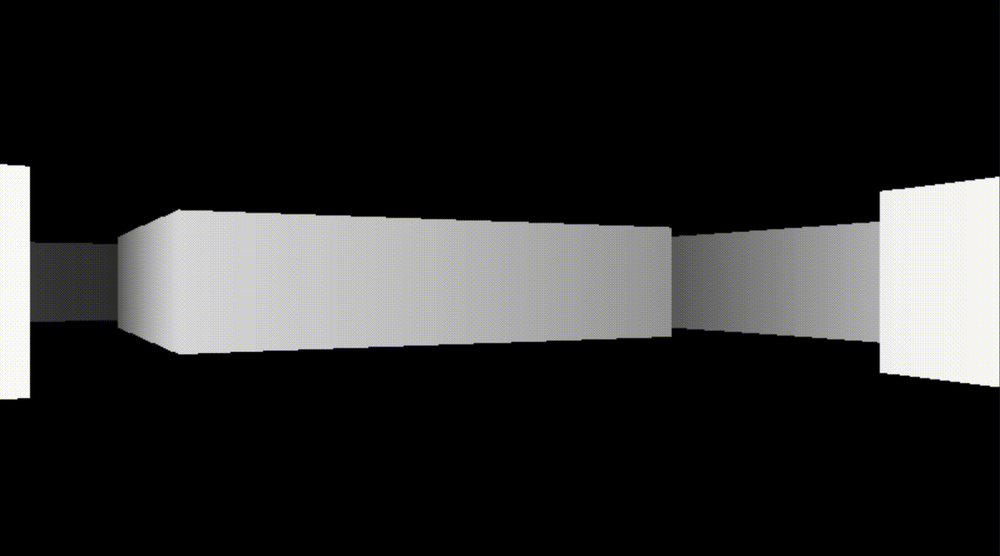

# Ray Casting

Ray Casting is a technique to create a 3D rendition from a 2D matrix. This implementation was created using Python and PyGame.

## Screenshot



## Run Locally

```bash
pip install pygame

python main.py
```
## Acknowledgements

 - [Doom 3D](https://www.youtube.com/watch?v=ECqUrT7IdqQ)
